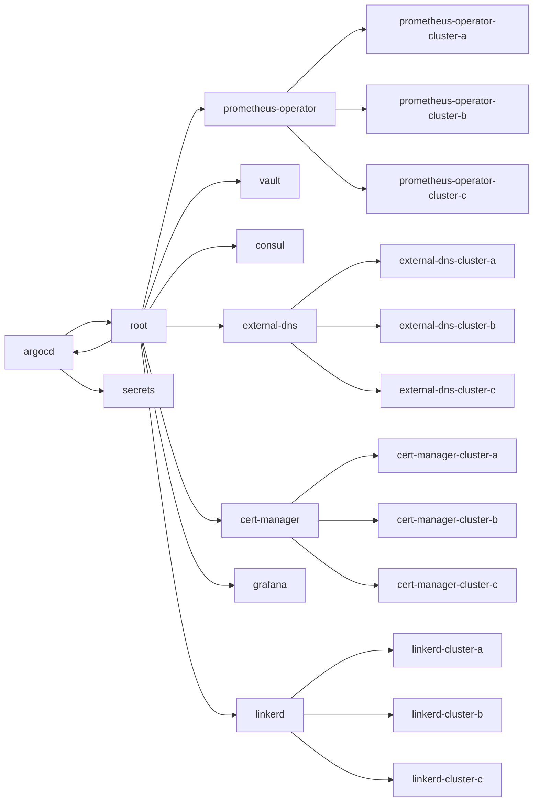

# Cluster Infrastructure
This repository contains infrastructure applications which are deployed to most clusters.
These applications provide the developers with the necessary tools to easily deploy and manager their own applications.

## List of applications
| Application | Management cluster | Other Clusters |
|-------------|--------------------|----------------|
| ArcoCD      | yes                | no             |
| ArcoCD      | yes                | no             |
| Vault       | yes                | no             |
| CertManager | yes                | yes            |
| Prometheus  | yes                | yes            |
| Thanos      | yes                | no             |
| Grafana     | yes                | no             |
| Linkerd     | no                 | yes            |

# Deployment order
Yellow: ApplicationSet
Orange: Application


## Bootstrapping
# ArgoCD
Because ArgoCD is not available on an empty cluster, there is no way for it to deploy itself.
To deploy a fresh ArgoCD installation, first deploy the kustomize manifest for ArgoCD manually into the management cluster.
It does require a secret with credentials to Vault. But since Vault is not setup yet, we create an empty secret.
We will fill the secret after we deployed Vault

Because we deploy the CRDs from the same kustomization, we might need to deploy it multiple times until all CRD are succesfully registered.

```shell
cd argocd
kustomize build | kubectl apply -f -
kubectl create secret generic -n argocd argocd-vault-plugin-credentials
```

# Hashicorp Vault
This repository does not include the secret values needed to access the git repositories where the ArgoCD manifests are
fetched from.
Hashicorp Vault is used to manage secrets outside of git.
It uses the argocd-vault-plugin to populate the secrets with their actual values when ArgoCD renders the manifests during deployment. 

Bootstrapping Hashicorp Vault requires manual configuration of keys and configuration of required keys.
1. Get `repo` scoped access token from Github.
2. Configure this temporary git repository in ArgoCD web interface with the access token from step one. (use port-forwarding to access the interface)
3. Wait until ArgoCD deployed Vault. (Note Vault's pods will not pass their readyness probes)
4. Follow the [Initialize and unseal Vault](https://learn.hashicorp.com/tutorials/vault/kubernetes-raft-deployment-guide?in=vault/kubernetes#initialize-and-unseal-vault) instructions.
5. Login into the web interface of Vault (again using port-forwarding). Use the root token from the previous step.
6. Create a new `kv` secrets engine on path `secret`.
7. Create a new secret on path `repositories/cluster-management`, with key/value `password/<token from step 1>`
8. Delete the previous created secret
   ```shell
   kubectl delete secret -n argocd argocd-vault-plugin-credentials
   ```
9. Create a new secret to access Vault with the token from initializing Vault.
   ```shell
   kubectl create secret generic -n argocd argocd-vault-plugin-credentials \
   --from-literal=VAULT_ADDR=http://vault.hashicorp:8200 \
   --from-literal=VAULT_TOKEN=ping token-created-previous-step \
   --from-literal=AVP_TYPE=vault \
   --from-literal=AVP_AUTH_TYPE=token
   ```
10. Restart rollout of the `argocd-repo-server` so it reads the new secret.
11. Delete the secret `repo-dddddd` from namespace `argocd`.