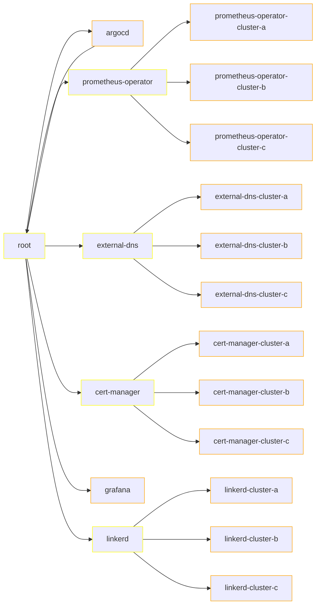

# Cluster Infrastructure
This repository contains infrastructure applications which are deployed to most clusters.
These applications provide the developers with the necessary tools to easily deploy and manager their own applications.

## List of applications
| Application | Management cluster | Other Clusters |
|-------------|--------------------|-----------------|
| ArcoCD      | yes                | no              |
| ExternalDNS | yes                | yes             |
| CertManager | yes                | yes             |
| Prometheus  | yes                | yes             |
| Thanos      | yes                | no              |
| Grafana     | yes                | no              |
| Linkerd     | no                 | yes             |

# Deployment order
Yellow: ApplicationSet
Orange: Application
